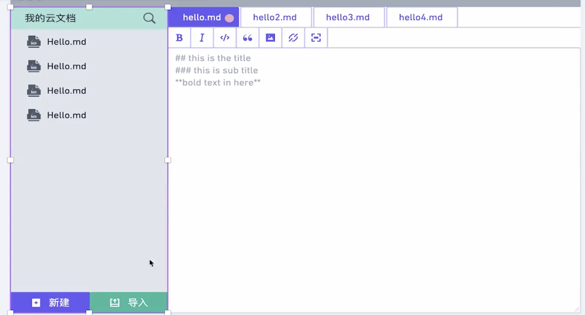

# md-native

这是一款用于管理md的原生桌面应用

- 警告 Unknown at rule @tailwindcss 可以设置"css.lint.unknownAtRules": "ignore"

- feat： 新功能（feature)
- fix: 修补 bug
- docs: 编写文档
- style: 格式化，文档样式调整
- refactor: 重构某个功能点
- test: 增加测试用例相关代码
- chore: 一些杂事